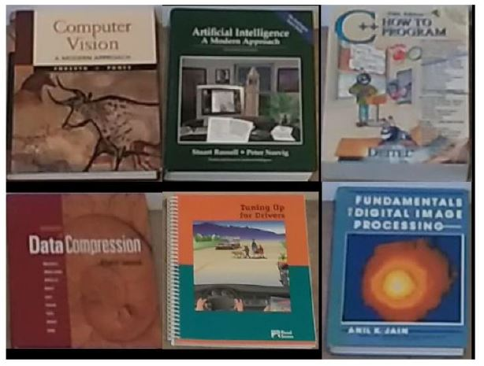
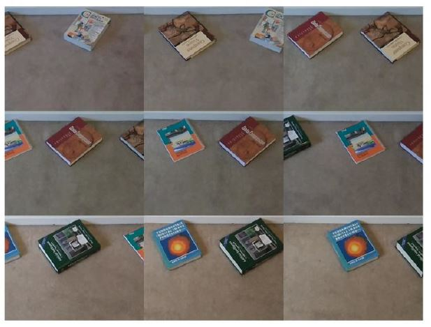
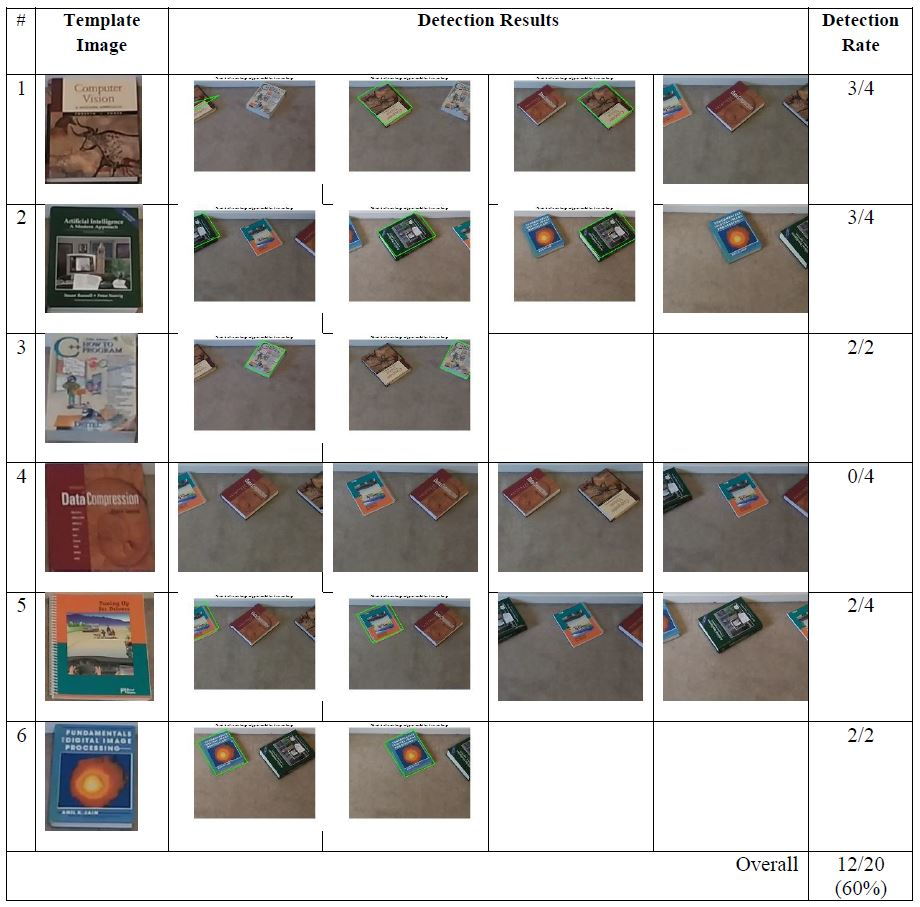
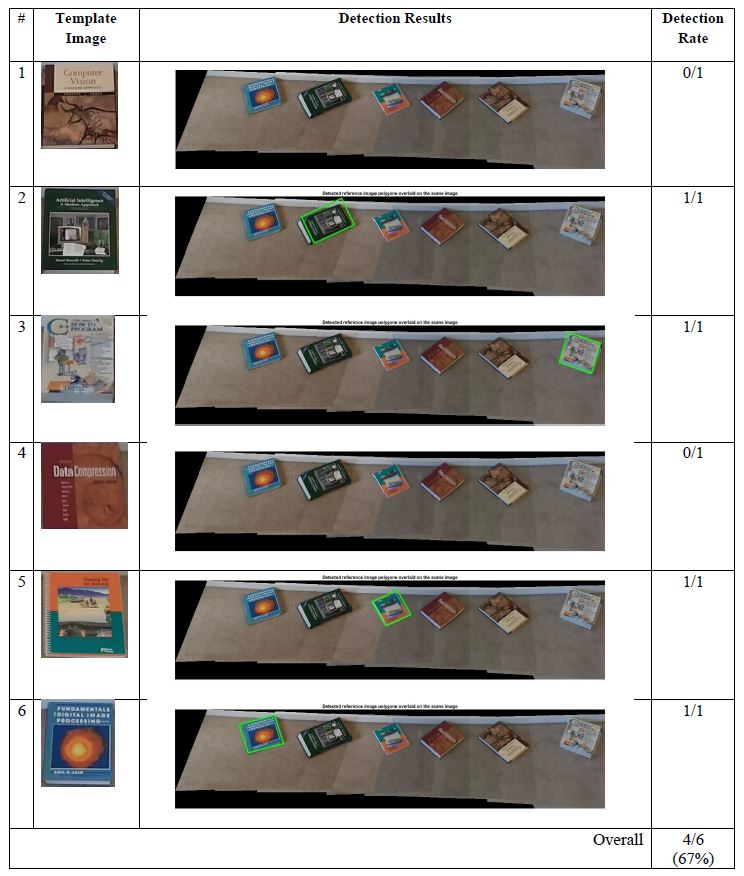

## Image Stitching and Object Detection & Recognition using Matlab

## 1. Objective

The objective of this project is to demonstrate two important computer vision functionalties:

* Panorama construction via image stitching and mosaicking
* Object detection and recognition via and template feature matching.

## 2. Experimental Setup

In order to implement the desired image stitching and object recognition algorithms, we setup the following scenarios:

* Suppose we have template images of a set of objects:
  * In our application, we have template images of 5 different books
* We shall clutter these 6 books nearby each other:
  * The books are cluttered on the floor near each other with some separation between consecutive books
  * The books are also randomly oriented when placed on the floor 
  * The 5 books are arranged almost linearly
* Using a phone camera, acquire multiple images from left to write in such a way:
  * There is at least one book in each image
  * There a relatively significant overlay between consecutive images
  * At least part of one object appears in 2 consecutive images
  * The images are ordere from left-to-right.

## 3. Collected Data

The template images of the 6 objects of interest are illustrated in the next figure.

We also acquired 9 ordered scene images according the the experimental setup described in the previous section. 

## 4. Approach

The implemented approach is two folds:

1. Apply MATLAB image backprojection and stitching functionalities to stitch the 9 acquired scene images together and construct a scene panorama
2. Apply MATLAB image feature detection and matching in order to detect and recognize the temples of the 6 objects of interest in each of the acquired 9 scene images as well as the constructed scene panorama.

## 5. Sample Results

The object detection and recognition results of the 6 objects of interest, using the 9 acquired scene images, are illustrated in the next figure.

The object detection and recognition results of the 6 objects of interest, using the constructed scene panorama image, are illustrated in the next figure.

## 6. Conclusion

We have demonstrated the process of selecting and implementing applicable image stitching and object detection techniques in order to identify objects of interest in the scene images as well as the panorama of stitched images. This process involves the following steps:

* Acquiring suitable imagery data, consisting of scene images and template images of the objects of interest.
* Adapting image stitching MATLAB functionalities to construct a scene panorama by stitching the acquired ordered images together
* Adaptive object detection and recognition MATLAB functionalities to try to detect and match each template of the 6 objects of interest in the 9 acquired scene images as well as in the constructed panaorama image.
* Processing the input data and generating the desired results
* Analyzing the experimental results in order to assess the performance of the applied algorithms.

Based on the limited experimental results, we conclude the following:

* Feature-based image stitching and object detection methods are generally robust to changes in scale, orientation and illumination between the different images. 
* The implemented feature-based object detector is also robust to partial occlusion of the objects of interest. 
* Despite their advantages, the implemented feature-based methods are not without limitations. 
* As observed in the figures above, the stitched panorama of the scene images suffers from minor mis-alignment and the some of the objects of interest were not correctly detected in the scene or the panorama image. 
* These deficiencies are likely due to the lack of good matched features in the scene or template images. As such, an insufficient number of good and distinctive features can be found in images of smooth surfaces, such as book covers, but they are more abundant in images of textured surfaces.

Potential future work may include the following investigations:

* Apply blending in order to improve the quality of the panorama image by reducing the undesirable boundary artifacts of the stitched images.
* Explore algorithms that can handle low-textured or smooth surface, shiny or glared surfaces. Most existing feature-based approaches sometimes fail in finding meaningful features on such surfaces. For such surfaces, one may apply a feature detector to extract key points on edges and corners (less sensitive to glare) instead of a detector that typically extracts interest points on blob-like structures (more sensitive to glare).

## References: 
1. MATHWorks. Feature Based Panoramic Image Stitching. Retrieved from: https://www.mathworks.com/help/vision/ug/feature-based-panoramic-image-stitching.html (October 4th, 2022).
